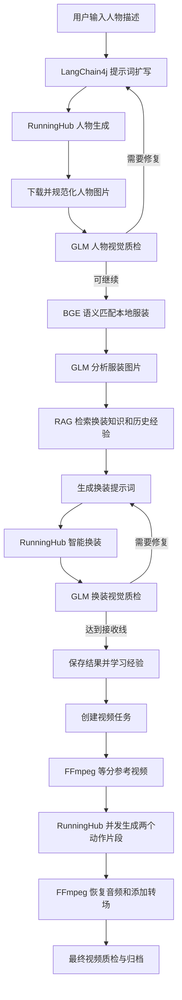

# 一个老程序员的 AI 应用实践：从人物生成、智能换装到视频合成

> 本文记录一个基于 Java、Spring Boot、LangChain4j、GLM 多模态模型和 RunningHub 搭建的服装替换项目。它不是一个只会调用大模型聊天接口的 Demo，而是一条包含提示词扩写、图片生成、视觉质检、服装检索、RAG、失败重试、经验学习和视频合成的完整 AI 工作流。

## 一、为什么要做这个项目

作为一名长期从事传统 Java 开发的程序员，我最初学习 AI 应用时有一个明显困惑：大模型除了聊天、写文章和回答问题，究竟怎样进入真实业务系统？

传统项目的特点是确定性。输入参数经过校验，程序按照固定规则执行，数据库结果也可以精确验证。但 AI 模型输出具有概率性：同一个提示词可能生成不同图片，视觉模型可能给出不同判断，第三方生成接口还可能遇到审核、超时、限流和资源不足。

因此，这个项目真正想学习的不是“怎样调用一个 AI API”，而是：

- 怎样把大模型放进 Java 业务流程。
- 怎样控制大模型的不确定性。
- 怎样让 AI 的输出可检查、可重试、可追踪。
- 怎样使用 RAG 让系统拥有项目自己的服装知识。
- 怎样把图片生成继续扩展到视频生产。

最后形成的业务目标是：用户输入一句简单人物描述，系统自动生成人物、匹配本地服装、完成智能换装，再把人物原图和换装结果制作成一段动作迁移视频。

## 二、项目实现了什么

系统目前包含四个主要业务模块。

### 1. 人物图片生成

用户可以输入“卧室中的亚洲女性”“海边人物写真”等简单描述。系统通过 LangChain4j 调用 GLM，将简短描述扩写为完整图片生成提示词，随后调用 RunningHub 的 ComfyUI 工作流生成人物图片。

人物生成支持普通版和增强版两套 RunningHub 应用，也支持使用分号一次提交多条描述，异步创建多个人物任务。

### 2. 服装选择与智能换装

项目读取本地 `clothing` 目录中的服装图片。点击“生成本地资料”后，GLM 会分析每张服装图，提取颜色、材质、版型、风格、场合、季节、发型、头饰和配饰等结构化资料，并保存到 MySQL。

人物生成完成后，系统通过中文 Embedding 将人物描述和服装资料转成向量，选择语义最匹配的服装，再调用 RunningHub 完成换装。

### 3. 多模态质量检查和经验学习

人物图生成后，视觉模型会检查人体结构、图片质量和提示词一致性。换装完成后，视觉模型继续对比人物原图、服装参考图和换装结果图，检查身份、背景、服装、发型和配饰是否正确。

任务通过质量门后，系统会提取本次成功经验，写入 MySQL，并实时加入 RAG 索引，供后续任务检索。

### 4. 视频动作迁移与合成

图片任务完成后，可以继续创建视频任务。系统从本地 `video_ai` 目录选择一个参考视频，将它平均拆成两个片段：

- 人物原图对应第一个动作片段。
- 换装结果图对应第二个动作片段。

两个片段通过 RunningHub 动作迁移工作流生成后，再使用 FFmpeg 恢复音频、统一参数、添加推进或推远转场，最终合成为一段完整视频。

## 三、整体技术架构



从架构上看，它是一条由 Java 控制的确定性工作流。AI 并没有随意决定是否调用外部接口，而是在提示词扩写、图片理解、质量评分和经验提取等语义环节发挥作用。

## 四、LangChain4j 在项目中的作用

### 1. 使用 AI Service 表达业务语义

传统写法通常需要手工构建请求 JSON、调用 HTTP 接口、再从模型返回文本中提取结果。LangChain4j 的 AI Service 可以把模型能力定义成具有业务含义的 Java 接口。

项目中主要有两类 AI Service：

- 人物 AI：负责人物提示词扩写、人物图片检查和审核失败后的提示词重写。
- 服装视觉 AI：负责服装图分析、换装结果检查和经验提取。

通过 `@SystemMessage` 固定模型角色、输出要求和业务边界，通过 `@UserMessage` 传入当前任务描述与图片。业务代码调用的是 Java 方法，而不是一段没有类型约束的模型对话。

### 2. 结构化输出

模型返回内容不会直接作为自由文本在系统中流转，而是映射成 Java `record`：

- `PortraitPromptSpec`：人物样貌、姿态、环境、光线、构图和最终提示词。
- `PortraitQualityReport`：人体结构、提示词一致性、画质分数和纠正提示词。
- `FashionReferenceSpec`：服装、材质、发型、头饰、配饰和必须迁移元素。
- `OutfitQualityReport`：服装匹配、身份保持、发饰匹配和背景保持分数。
- `ClothingCatalogAnalysis`：服装资料库中的结构化检索信息。
- `FashionExperienceDraft`：从成功任务中提取的可复用经验。

结构化输出非常重要。业务代码不需要从“我认为这张图大概有八十分”这样的自然语言中猜测分数，而是可以直接读取 `overallScore`、`passed` 和 `retryable` 字段。

### 3. 多模态图片输入

项目使用 LangChain4j 的 `ImageContent` 把本地图片交给 GLM 视觉模型。图片在发送前会进行缩放和 JPEG 编码，避免原始图片过大导致请求超时和视觉 Token 浪费。

人物质检输入一张人物候选图；服装分析输入一张服装参考图；换装质检则按照固定顺序输入人物原图、服装图和换装结果图。

## 五、提示词不是一句话，而是业务规格

人物提示词由三部分组成：

1. 用户原始描述。
2. GLM 根据描述补充的人物、环境、光线和摄影风格。
3. Java 强制追加的固定业务约束。

这样设计是因为模型扩写有可能遗漏关键要求。固定约束由 Java 添加，可以保证输出尺寸、成年人物、正面站立、完整入镜和后续换装需要的构图不会丢失。

换装提示词同样采用“固定前缀 + AI 视觉分析 + RAG 上下文”的方式。

固定前缀负责保护图 1：

- 人物脸部五官、脸型和眼神不变。
- 身体姿势和肢体动作不变。
- 背景、光线和镜头不变。

视觉模型负责分析图 2：

- 发型、发色和发饰。
- 上衣、裙装、裤装和鞋袜。
- 材质、颜色、纹理和层次。
- 项链、手套、腰饰和腿部装饰。

RAG 再补充项目经验，例如头饰容易遗漏、背景容易被换装模型改写、复杂配饰需要明确佩戴位置等。

## 六、人物质检和换装质检

AI 负责观察和评分，Java 负责做决定。这是项目中非常重要的一条边界。

人物质量门会检查：

- 图片技术上是否可用。
- 人体结构是否正常。
- 图片是否符合扩写后的提示词。
- 清晰度、曝光和构图是否达到要求。

换装质量门会检查：

- 综合评分。
- 服装匹配评分。
- 人物身份保持评分。
- 发型和头饰匹配评分。
- 背景和姿势是否保持。

模型给出概率性判断后，Java 根据配置阈值决定是否接受、是否重试以及是否进入下一阶段。这样可以防止模型在一次回答中同时充当观察者和最终决策者。

当换装综合评分达到可接受线时，不再为了少量细节重复消耗生成费用，而是把遗漏内容写入学习经验，供下一次任务检索。

## 七、有限重试，而不是无限 Agent 循环

项目实现了三类受控反思循环：

```text
人物提示词 -> RunningHub 审核拒绝 -> AI 安全重写 -> 再次提交
人物生成 -> 人物质检 -> 纠正提示词 -> 重新生成
换装生成 -> 换装质检 -> 纠正提示词 -> 重新换装
```

所有循环都有最大次数。大模型不能因为“不满意”就无限调用收费接口。

模型繁忙时，系统会记录第几次调用，并按固定间隔重试。提示词扩写失败时任务停止，不会偷偷使用默认提示词继续产生费用；视觉质检经过规定次数仍无法完成时，则记录“未评估”状态并按照当前业务规则处理。

这类设计比一个完全自由的 Supervisor Agent 更适合当前项目，因为图片和视频生成都具有费用高、耗时长和外部副作用明显的特点。

## 八、服装资料库与语义选衣

本地服装图片本身不能直接进行文本检索，所以系统先通过视觉模型把图片转成结构化资料。

```text
clothing 目录图片
-> 计算 SHA-256
-> GLM 多模态分析
-> ClothingCatalogAnalysis
-> 写入 MySQL clothing_profile
```

SHA-256 用于判断图片内容是否发生变化，避免每次刷新都重复调用视觉模型。

人物提示词扩写完成后，本地 BGE 模型会把人物描述和每套服装的 `search_text` 转成向量，通过相似度选择最匹配的服装。页面和步骤日志会展示匹配服装、匹配度和匹配规则，让选衣不再是一个不可解释的随机结果。

为了避免连续使用同一套服装或同一个动作视频，项目还记录本地资源的使用次数和最后使用时间，优先选择使用次数更少的资源。

## 九、RAG 在换装流程中的位置

RAG 不是用来替代视觉模型看服装图，而是在视觉模型已经理解服装之后，为当前换装任务补充相关经验。

```text
knowledge/fashion/*.md
-> 文档加载
-> 递归切分 Chunk
-> BGE 生成 512 维向量
-> InMemoryEmbeddingStore

用户描述 + FashionReferenceSpec
-> 生成检索 Query
-> Top-K 相似度检索
-> 过滤低分结果
-> 注入换装提示词
```

当前知识库包含身份保持、姿态和背景、发型与配饰、材质纹理以及失败修复策略等内容。

RAG 放在服装分析之后，是因为此时系统已经知道服装颜色、材质、头饰和必须迁移元素，检索 Query 比只使用“卧室美女”之类的原始描述更准确。

## 十、任务完成后的经验学习

只有经过视觉质检并达到接收条件的任务才允许进入学习阶段。GLM 会从成功任务中提取：

- 本次成功采用了什么策略。
- 适用于哪些服装和场景。
- 哪些细节容易遗漏。
- 下一次提示词应该强调什么。
- 哪些规则不应该被过度泛化。

经验写入 MySQL `fashion_learned_experience`，随后立即生成 Embedding 并加入当前内存索引。应用重启时，会把 Markdown 知识和数据库中的已批准经验一起重新建立索引。

这不是模型训练或微调，而是一种可追踪、可删除、可审核的检索增强学习方式。

## 十一、异步任务、MySQL 和可观测性

人物生成和视频生成都不是适合同步等待的请求。图片任务可能持续几分钟，视频动作迁移可能持续半小时以上。因此接口只负责创建任务，后台线程池负责执行，前端通过任务 ID 轮询状态。

MySQL 保存：

- 图片任务快照。
- 每一步执行事件。
- 人物候选图和质检结果。
- 换装候选图和质检结果。
- 服装资料。
- 成功学习经验。
- 视频任务状态和最终文件。

应用重启时，系统会识别上一次仍处于排队或运行状态的任务，并标记为异常中断，避免页面永久显示“处理中”。

页面分为工作台、图片任务、视频任务、资料库和日志。每个任务可以查看结构化步骤日志，同时也可以查看 Spring Boot 原始运行日志。

## 十二、视频动作迁移和 FFmpeg 合成

视频流程包含以下步骤：

1. 从 `video_ai` 目录公平选择参考视频。
2. 使用 FFprobe 获取时长、分辨率、帧率和音频信息。
3. 使用 FFmpeg 将视频等分成两个片段。
4. 根据工作流要求规范分辨率、帧率和最大帧数。
5. 上传人物图片和视频片段到 RunningHub。
6. 使用 Plus 实例并发执行两个动作迁移任务。
7. 每两分钟轮询一次远程任务状态。
8. 下载两个生成视频。
9. 恢复参考视频音频并统一编码参数。
10. 使用推进或推远效果完成转场。
11. 合并并输出 `final-video.mp4`。
12. 检查最终视频时长、分辨率、帧率和音频完整性。

视频任务拥有独立的任务列表，不会把半小时的视频状态混在图片任务中。

## 十三、开发过程中遇到的真实问题

这个项目最有学习价值的部分，往往不是功能顺利完成，而是处理外部系统的不确定性。

### 1. HTTPS 握手失败

RunningHub 返回的 COS 图片地址可以在浏览器下载，但 Java 请求偶尔出现 TLS 握手失败或连接重置。最终通过独立下载超时、有限重试和受信任域名处理降低失败概率。

### 2. URL 中包含空格

视频结果地址包含类似 `h264 yuv420p_xxx.mp4` 的文件名。直接调用 `URI.create` 会抛出非法路径异常。下载前需要只对路径中的空格进行 `%20` 编码，同时保留原始 HTTPS 协议，不能擅自改成 HTTP。

### 3. 上传请求长时间卡住

Multipart 上传如果没有独立的连接和读取超时，会表现为日志停在“上传开始”。项目为上传建立了独立超时、文件大小限制和重试策略。

### 4. RunningHub 显存不足

视频动作迁移最初在 `WanVideoSampler` 节点发生 GPU OOM。排查后确认关键因素是 RunningHub 实例类型，将 `instanceType` 调整为 `plus` 后才具备足够显存。这个案例说明不能只根据输入分辨率猜测问题，还要结合远程工作流节点和实例资源定位。

### 5. 服务重启后遗留运行状态

后台 Java 线程在服务停止后无法恢复，但数据库仍保存 `RUNNING`。项目启动时会恢复这些异常状态，明确告诉用户任务已经中断，可以重新创建，而不是继续展示一个永远不会完成的节点。

### 6. 免费模型访问量过大

GLM Flash 模型可能返回“当前访问量过大”。系统使用带次数日志的定时重试，每次等待固定时间，并严格限制最大调用次数。

## 十四、AI 和普通代码怎样分工

这个项目最后形成了比较明确的边界。

AI 负责：

- 理解用户的简短描述。
- 理解人物图和服装图。
- 生成结构化语义。
- 找出图片问题。
- 给出纠正提示词。
- 提取可复用经验。

Java 负责：

- 状态机和任务编排。
- 参数校验和权限边界。
- 是否调用收费接口。
- 最大重试次数。
- 质量阈值。
- 文件上传、下载和归档。
- 数据库持久化。
- 任务取消和物理删除。
- 视频拆分和合成。

AI 输出具有概率性，Java 业务规则保持确定性。只有把二者结合起来，AI 才能进入真实生产流程。

## 十五、使用到的主要技术

- Java 17
- Spring Boot、Spring Web、Spring JDBC
- MySQL、HikariCP
- LangChain4j AI Services
- GLM-4.6V-Flash 多模态模型
- OpenAI 兼容接口
- LangChain4j `ImageContent`
- JSON 结构化输出和 Java `record`
- BGE-small-zh 中文 Embedding
- LangChain4j 文档加载与切分
- `InMemoryEmbeddingStore`
- RunningHub 和 ComfyUI 工作流
- `FutureTask`、`CompletableFuture` 和线程池
- FFmpeg、FFprobe
- 原生 JavaScript Fetch 和前端轮询
- 文件系统任务归档
- JUnit、Mockito 和 Spring Boot Test

## 十六、这个项目仍然缺少什么

作为学习项目，它已经覆盖了提示词、多模态、RAG、质检、反思重试、知识学习和视频处理。但距离商业生产系统仍有差距：

- 缺少用户认证、权限和多租户。
- 缺少 Redis、RabbitMQ 或 Kafka 持久化任务队列。
- 缺少分布式锁和真正的任务恢复。
- 缺少 Prompt 和模型版本管理。
- 缺少 Token、费用和成功率指标。
- 缺少完整的 RAG 离线评测集。
- 当前向量库仍是进程内存储。
- 缺少对象存储、CDN 和文件生命周期管理。
- 缺少 Docker、CI/CD、监控和告警。
- 还没有服装分割、人体姿态估计和专用虚拟试衣模型。

这些缺口正好可以作为下一阶段从“AI 学习项目”走向“生产 AI 平台”的学习方向。

## 十七、总结

这个项目让我认识到，AI 应用开发并不是把一个大模型接口接到页面上。真正困难的部分是：怎样定义 AI 与业务代码的边界，怎样检查 AI 输出，怎样处理失败，怎样控制成本，怎样让每一个模型判断都可以追踪和复盘。

从一句人物描述开始，经过提示词扩写、人物生成、视觉质检、服装语义检索、RAG、智能换装、经验学习，再到最终视频合成，这条链路已经完整体现了 AI 应用工程的核心思路：

```text
确定性 Java 工作流
+ 概率性大模型能力
+ 多模态视觉理解
+ RAG 知识检索
+ 质量门和有限重试
+ 可观测、可持久化的工程体系
```

对于一个从传统 Java 开发转向 AI 应用开发的程序员来说，这个项目最大的价值不是生成了多少张人物图片，而是建立了一套可以继续迁移到客服、工单、文档检索、日志分析和真实生产系统中的 AI 工程方法。
